# Rendimento

Calculadora de investimentos brasileira. Projeta juros compostos com imposto de renda e inflação descontados, compara aplicações sob o mesmo cenário e acompanha câmbio, cripto e B3. Aplicação estática, sem backend e sem coleta de dados.

**[rendimento-omega.vercel.app](https://rendimento-omega.vercel.app)**

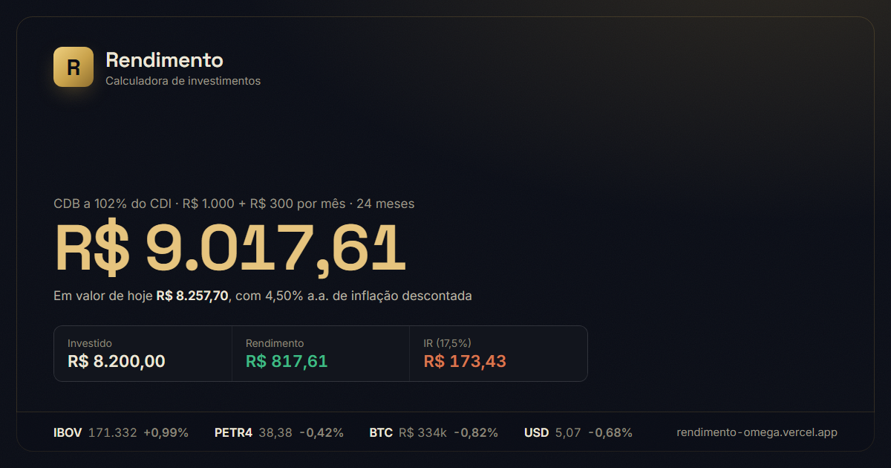

<sub>React 19 · TypeScript · Vite 8 · Tailwind · Zustand · Recharts · Zod · Vitest · 56 testes · 0 vulnerabilidades</sub>

> As simulações são estimativas e não constituem recomendação de investimento.

---

## Sumário

- [Visão geral](#visão-geral)
- [Capturas](#capturas)
- [Arquitetura](#arquitetura)
- [Motor de cálculo](#motor-de-cálculo)
- [Camada de mercado](#camada-de-mercado)
- [Gerência de estado](#gerência-de-estado)
- [Segurança](#segurança)
- [Testes](#testes)
- [Build e deploy](#build-e-deploy)
- [Desenvolvimento local](#desenvolvimento-local)
- [Estrutura](#estrutura)
- [Decisões e trade-offs](#decisões-e-trade-offs)

---

## Visão geral

Quatro rotas, todas client-side:

| Rota | Função |
| ---- | ------ |
| `/` | Calculadora. Projeta o valor futuro ou resolve o aporte necessário para uma meta. |
| `/mercado` | Cotações de câmbio, cripto e B3 em tabela densa, com indicador de frescor por bloco. |
| `/comparar` | Mesmo cenário aplicado a várias aplicações, ordenado por retorno líquido, mais a tabela de referência. |
| `/historico` | Simulações salvas no `localStorage` do navegador. |

Onze aplicações estão cadastradas — poupança, CDB, LCI/LCA, três títulos do Tesouro, ações, FIIs, ETF, dólar e cripto. As de renda variável têm retorno esperado editável, já que não existe taxa contratada.

O app funciona offline: perdendo as APIs, cada bloco de mercado cai para o último dado bom e se rotula como atrasado ou demonstração, em vez de quebrar ou mostrar número velho como se fosse atual.

## Capturas

| Calculadora | Mercado |
| ----------- | ------- |
| 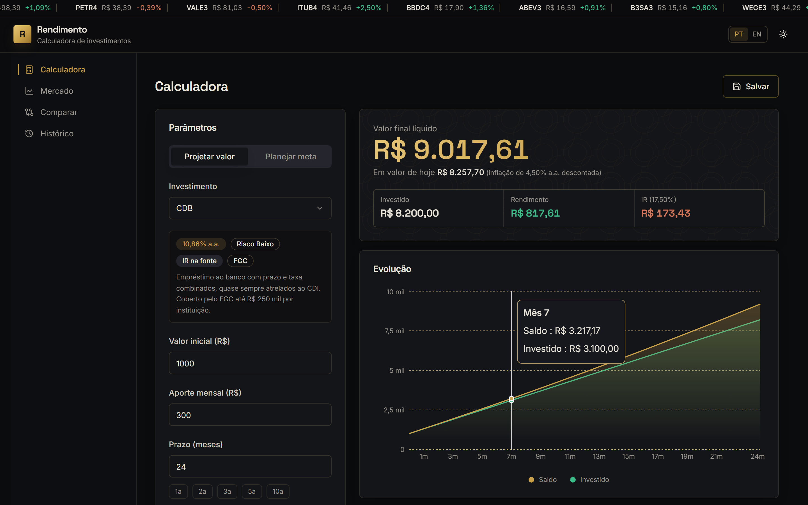 | 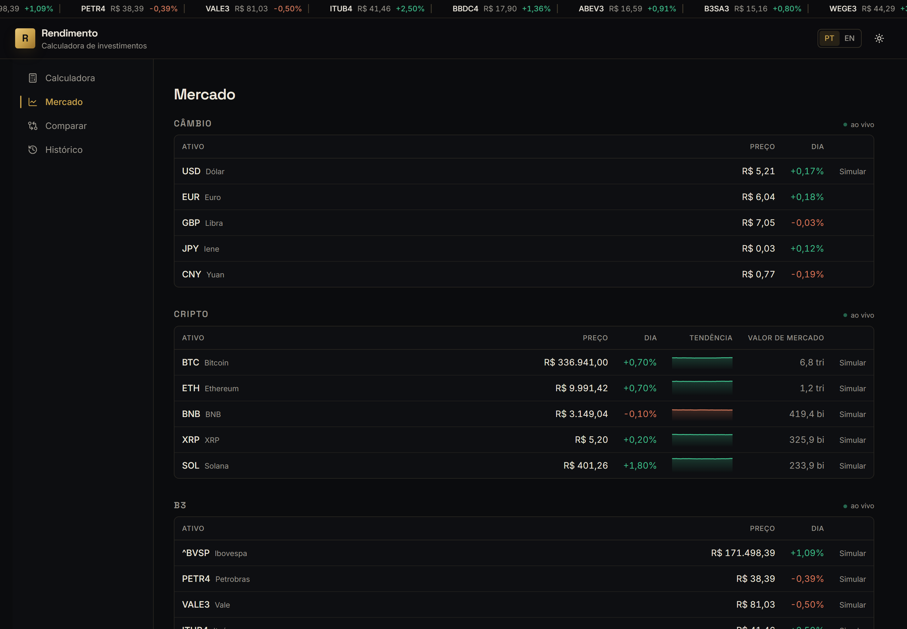 |

| Comparar | Histórico |
| -------- | --------- |
| 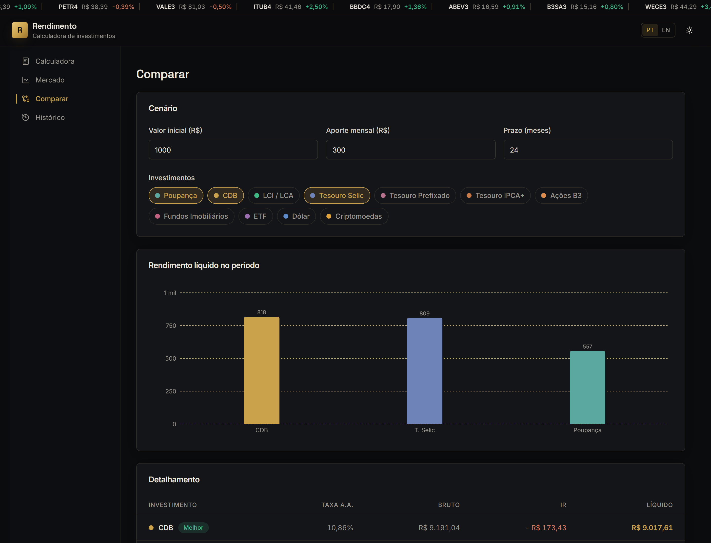 | 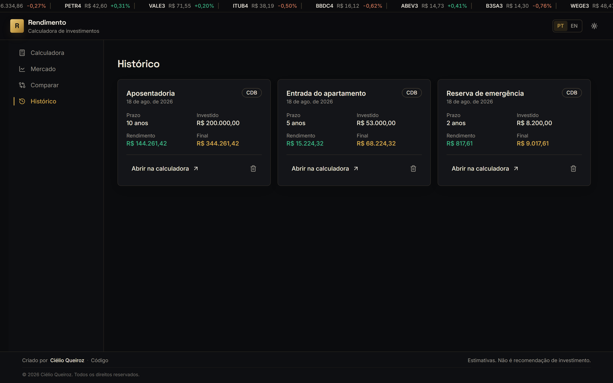 |

| Tema claro | Mobile |
| ---------- | ------ |
| 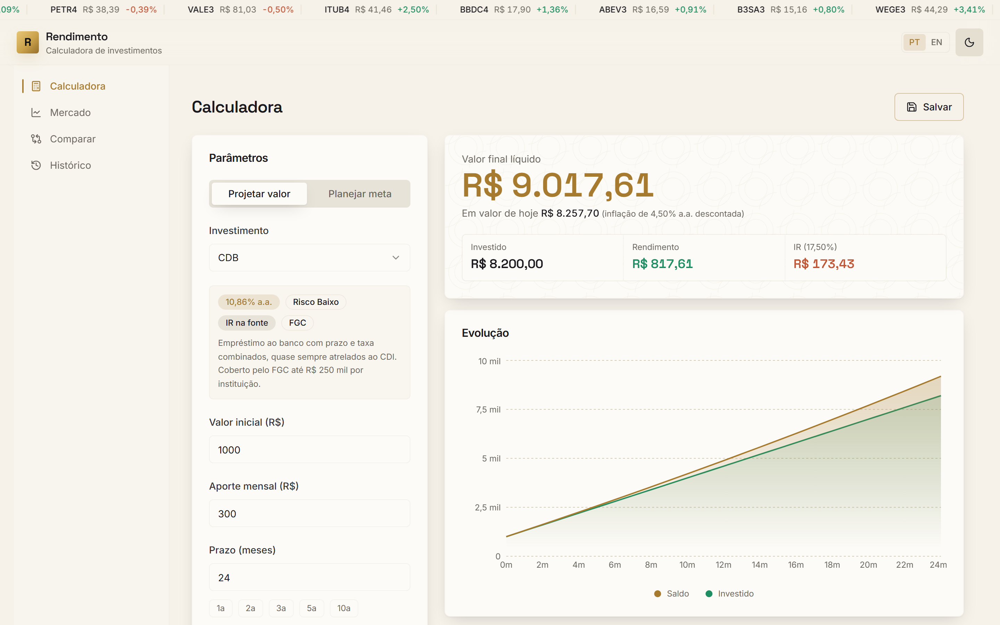 | 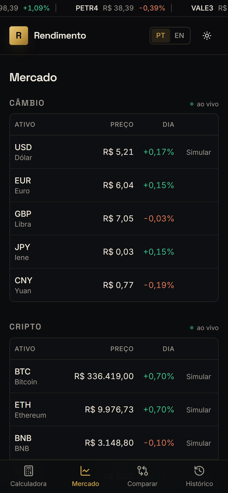 |

## Arquitetura

Não há servidor de aplicação. O build produz arquivos estáticos; o navegador fala direto com as APIs públicas de cotação; a persistência é local.

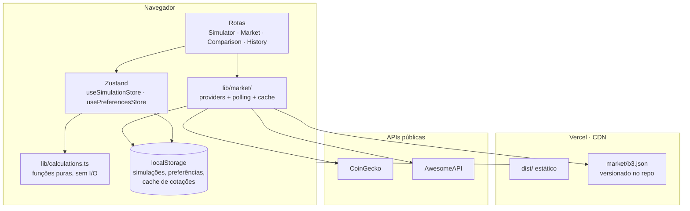

Três regras sustentam esse desenho:

1. **O cálculo financeiro é puro.** `lib/calculations.ts` não importa React, não lê storage e não faz rede. Recebe números, devolve números. Por isso a suíte de testes cobre a parte que importa sem montar componente nenhum.
2. **A rede nunca é caminho crítico.** Toda leitura de mercado tem fallback em camadas, e a UI sempre sabe dizer de quando é o dado que está exibindo.
3. **Nenhum segredo alcança o cliente.** O único token do projeto vive no runner do GitHub Actions, e o que sai de lá é um JSON de preços. Detalhes em [Segurança](#segurança).

## Motor de cálculo

O pipeline de uma simulação:

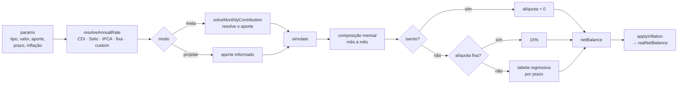

### Fórmulas

A taxa anual é convertida para a **mensal equivalente**, não dividida por doze:

$$i_m = (1 + i_a)^{1/12} - 1$$

O saldo compõe mês a mês, com o aporte entrando ao final de cada período:

$$S_n = S_{n-1}\,(1 + i_m) + A$$

No modo meta, o aporte sai da fórmula de anuidade, descontando primeiro o que o valor inicial rende sozinho:

$$A = \frac{M - S_0\,(1 + i_m)^n}{\dfrac{(1 + i_m)^n - 1}{i_m}}$$

E o resultado nominal vira poder de compra pela inflação acumulada no prazo:

$$S_{real} = \frac{S_{liq}}{(1 + \pi)^{n/12}}$$

### Tributação

O IR incide **apenas sobre o rendimento**, nunca sobre o principal, e segue a tabela regressiva por prazo:

| Prazo | Alíquota |
| ----- | -------- |
| Até 180 dias | 22,5% |
| 181 a 360 dias | 20,0% |
| 361 a 720 dias | 17,5% |
| Acima de 720 dias | 15,0% |

Poupança, LCI/LCA e dividendos de FII são isentos. Ações, ETF, dólar e cripto usam alíquota fixa de 15%.

> **Sobre o IOF:** não é aplicado, de propósito. O IOF regressivo só incide em resgates com menos de 30 dias, e o prazo mínimo aceito pelo formulário é de um mês. A tabela existia no código sem nunca ser chamada e foi removida, em vez de mantida como enfeite.

## Camada de mercado

Cada bloco de cotações é um `useMarketData(source)` independente, com polling próprio e degradação própria. A cadeia de fallback:

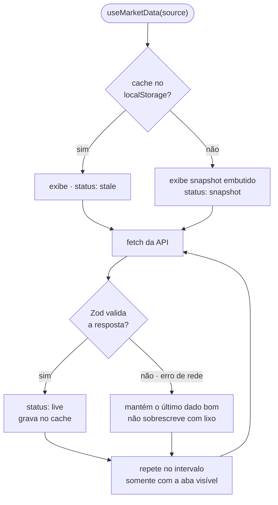

O `status` não é detalhe interno: ele vira o selo ao lado do título do bloco, então o usuário sempre sabe se está vendo preço ao vivo, defasado ou de demonstração. Um dado só é rotulado "ao vivo" se tiver menos de 15 minutos — o snapshot da B3 carrega o instante em que foi produzido, e é esse carimbo que vale, não a hora em que o navegador o baixou.

| Fonte | Dados | Intervalo | Token |
| ----- | ----- | --------- | ----- |
| [AwesomeAPI](https://docs.awesomeapi.com.br/) | 5 pares de câmbio | 30 s | Não |
| [CoinGecko](https://www.coingecko.com/) | 5 criptomoedas, com sparkline de 7 d | 30 s | Não |
| Snapshot próprio | Ibovespa + 11 ações da B3 | 60 s | Versionado pelo Actions |

Toda resposta externa passa por um schema Zod antes de virar `Quote`. Um payload com formato inesperado lança e cai no ramo de fallback — a UI nunca renderiza um objeto que não conferiu.

O polling pausa quando a aba sai de foco e retoma no `visibilitychange`, e cada ciclo aborta a requisição anterior via `AbortController`.

## Gerência de estado

Duas stores Zustand, com responsabilidades separadas:

- **`useSimulationStore`** — parâmetros, cenário de comparação e histórico. Não guarda o resultado calculado da tela: `computeSimulation` é chamada em `useMemo` a partir dos parâmetros, então resultado derivado nunca dessincroniza da entrada.
- **`usePreferencesStore`** — tema e idioma, com `persist`. Na reidratação valida o locale gravado e cai no padrão se ele não existir mais, o que evita ficar preso num idioma removido.

Para não piscar tema errado no primeiro paint, um script inline em `index.html` lê a preferência e aplica a classe `dark` antes do React montar.

## Segurança

### Modelo de ameaça

Sem backend, sem contas e sem dados pessoais, a superfície é curta: o que o build publica, o que o navegador busca de terceiros e o que fica no `localStorage`. O risco central é **vazar credencial no bundle** — e era exatamente o que acontecia.

### O token da B3

Vite **inlineia toda variável `VITE_*` como texto literal no JavaScript público**. A versão anterior lia o token da brapi por esse caminho, então bastava abrir o código-fonte para lê-lo. Um build com um valor-canário provava o vazamento:

```js
function kC(){return`CANARIO_SEGREDO_12345`}   // antes: token exposto a qualquer visitante
```

O caminho foi eliminado. Hoje o token é `BRAPI_TOKEN`, sem prefixo `VITE_`, e vive apenas como segredo do GitHub Actions, lido por `scripts/fetch-b3.mjs` dentro do runner:

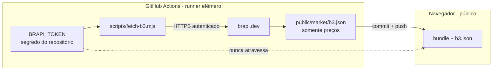

O bundle publicado não contém o token, nem a URL da brapi, nem qualquer código que fale com ela.

### Cabeçalhos

Configurados em `vercel.json` para toda resposta:

| Cabeçalho | Valor |
| --------- | ----- |
| `Content-Security-Policy` | `default-src 'self'`, com `connect-src` restrito às duas APIs de cotação, `frame-ancestors 'none'`, `object-src 'none'`, `form-action 'none'` |
| `X-Content-Type-Options` | `nosniff` |
| `X-Frame-Options` | `DENY` |
| `Referrer-Policy` | `strict-origin-when-cross-origin` |
| `Permissions-Policy` | câmera, microfone, geolocalização, pagamento e USB negados |

A CSP é a defesa mais útil aqui: mesmo que uma dependência seja comprometida, ela não consegue exfiltrar para um host que não esteja na allowlist.

### Entrada e persistência

- Respostas de API são validadas com Zod antes do uso.
- O que volta do `localStorage` também é validado por schema. Entradas adulteradas ou fora do formato são descartadas silenciosamente, em vez de fluírem para os gráficos e para a formatação de moeda. Dois testes cobrem esse descarte.
- Não há `dangerouslySetInnerHTML`, `innerHTML`, `eval` nem `new Function` em nenhum ponto do código.
- Links externos usam `rel="noreferrer"`.

### Segredos e CI

- `.gitignore` cobre `.env` e `.env.*`, com exceção do `.env.example` — que é template e não guarda valor.
- O histórico completo do repositório foi varrido em busca de credenciais; só há placeholders.
- No workflow do GitHub, o segredo chega por bloco `env:` em vez de ser interpolado direto no shell, e o job roda com `permissions: {}`.
- Dependências sem CVE aberto (`npm audit`: 0 vulnerabilidades).

### O que o app não faz

Não tem analytics, telemetria, cookies nem terceiros de rastreamento. Nada que você digita sai do seu navegador — as simulações ficam no `localStorage` e nunca são enviadas a lugar nenhum.

## Testes

56 testes em Vitest, concentrados onde o erro é caro e silencioso: cálculo financeiro, normalização de dados externos e persistência.

| Arquivo | Cobre |
| ------- | ----- |
| `calculations.test.ts` | Resolução de taxa por indexador, taxa mensal equivalente, tabela de IR, inflação, aporte de meta e `simulate` ponta a ponta |
| `localStorage.test.ts` | CRUD, ordenação, recuperação de dado corrompido e descarte de entrada adulterada |
| `market/format.test.ts` | Formatação de moeda, percentual com sinal, notação compacta e tempo decorrido |
| `market/snapshots.test.ts` | Cache, status `stale` e integridade dos snapshots embutidos |
| `providers/*.test.ts` | Mapeamento de CoinGecko, AwesomeAPI e brapi para `Quote`, incluindo payload malformado |

Componentes React não são testados de propósito: o valor estaria em testar o cálculo e o mapeamento, e ambos foram extraídos justamente para ficarem testáveis sem DOM.

```bash
npm test
```

## Build e deploy

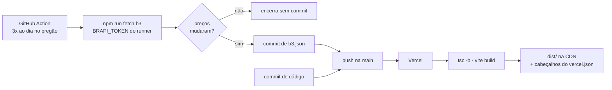

O snapshot da B3 é versionado, não gerado no build. Um workflow agendado busca as cotações na abertura, no meio e no fechamento do pregão e só commita quando algum preço mudou; o push resultante dispara o deploy. Assim o token fica restrito ao runner do Actions e o build da Vercel não precisa de segredo nenhum.

Um único segredo, opcional:

| Segredo | Onde | Sem ele |
| ------- | ---- | ------- |
| `BRAPI_TOKEN` | Segredos do repositório no GitHub | O snapshot para de ser atualizado e a B3 exibe o último dado versionado |

O `vercel.json` também reescreve todas as rotas para `index.html`, necessário porque o roteamento é client-side.

O GitHub Pages do repositório continua ligado, mas não hospeda mais o app: `pages-redirect.yml` publica apenas uma página de redirecionamento para a Vercel, preservando a rota, para que endereços antigos não caiam no vazio.

## Desenvolvimento local

Node.js 20 ou superior.

```bash
npm install
npm run dev
```

| Script | O que faz |
| ------ | --------- |
| `npm run dev` | Servidor de desenvolvimento com HMR |
| `npm run build` | Type-check e build de produção |
| `npm run preview` | Serve o build local |
| `npm run lint` | ESLint |
| `npm test` | Suíte de testes |
| `npm run test:watch` | Testes em modo observação |
| `npm run fetch:b3` | Regera `public/market/b3.json` (requer `BRAPI_TOKEN`) |

Para cotações reais da B3 em desenvolvimento:

```bash
BRAPI_TOKEN=seu_token npm run fetch:b3
npm run dev
```

## Estrutura

64 arquivos, cerca de 4.200 linhas de TypeScript.

```
src/
├── components/
│   ├── ui/           Primitivas shadcn/ui (Radix)
│   ├── layout/       Header, ticker, sidebar, footer, tema e idioma
│   ├── shared/       PageHeader, AnimatedNumber, EmptyState, Guilloche
│   ├── simulator/    Formulário, resultado e gráfico de evolução
│   ├── comparison/   Controles, gráfico, tabela e catálogo
│   ├── market/       Ticker, tabela de cotações e sparkline
│   └── history/      Cartão de simulação salva
├── constants/        Catálogo de aplicações e taxas de referência
├── i18n/             Dicionários pt/en e hook useTranslation
├── lib/              Cálculo, persistência, navegação e utilidades
│   └── market/       Providers, hook de polling, cache e formatação
├── pages/            Simulator, Market, Comparison, History
├── store/            Zustand
└── types/            Tipos compartilhados
```

## Decisões e trade-offs

**Sem backend.** Todo o cálculo é determinístico e as cotações são públicas, então um servidor só acrescentaria custo, latência e superfície de ataque. O preço é depender de CORS aberto nas APIs de terceiros, o que a cadeia de fallback absorve.

**Snapshot da B3 em vez de chamada direta.** O plano gratuito da brapi aceita um ativo por requisição — 12 requisições por visitante estouraria a cota rapidamente. Buscar uma vez no build e servir um JSON estático custa uma requisição por deploy e, de quebra, mantém o token fora do cliente.

**Estado derivado não é armazenado.** O resultado da simulação é recalculado por `useMemo` a partir dos parâmetros. Guardá-lo na store criaria duas fontes de verdade para o mesmo número.

**Dois idiomas, não cinco.** Uma calculadora de FGC, Tesouro Direto e IR regressivo tem público em português e, marginalmente, em inglês. Locales adicionais eram manutenção sem leitor.

**Bundle único de 981 kB (300 kB comprimido).** Quase tudo é Recharts. Para um app de quatro rotas em que três usam gráfico, dividir o código adiaria pouco e complicaria o carregamento. É o candidato natural caso a métrica de carregamento passe a incomodar.

**Componentes React sem teste.** A lógica que quebra em silêncio foi extraída para funções puras, que são testadas. Testar renderização traria custo de manutenção alto para pegar sobretudo regressão visual, que screenshot pega melhor.
